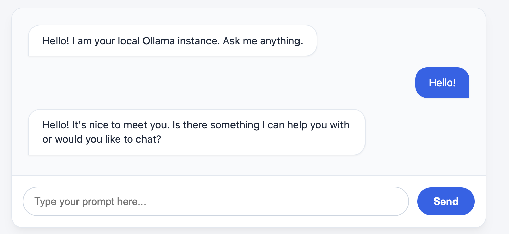

# Hooke's Boot Application

This is where I play around with Java in a Spring Boot application, augmented with Spring AI.

## Why Hooke's Boot? 

Because Hooke's Law is the *spring* constant in a harmonic oscillator.


## What is this?

A simple chat application that allows you to converse through a web chat UI to a locally-running Ollama model.

Once running visit: <a href="http://localhost:8080/chat">http://localhost:8080/chat</a>



## Local Set Up

This project uses Java 25, Spring Boot 4.1, and Spring AI 2.0. (See [build.gradle.kts](build.gradle.kts))

To build: 

```
./gradlew build
```

To run:

```
./gradlew runBoot
```

## Docker Set Up

To build and run with Docker:

```
docker compose build
```

```
docker compose up -d
```

On first boot, give the Ollama container a minute or two to pull the model.

Stop:

```
docker compose down
```